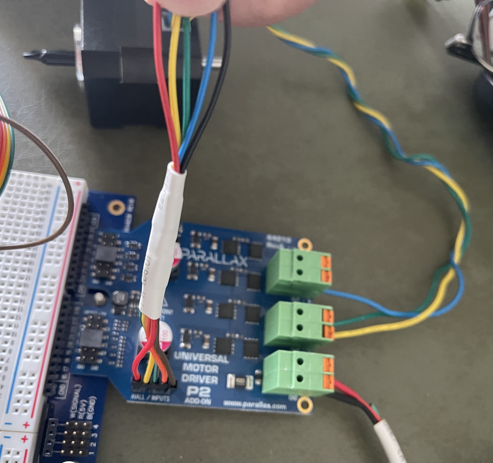
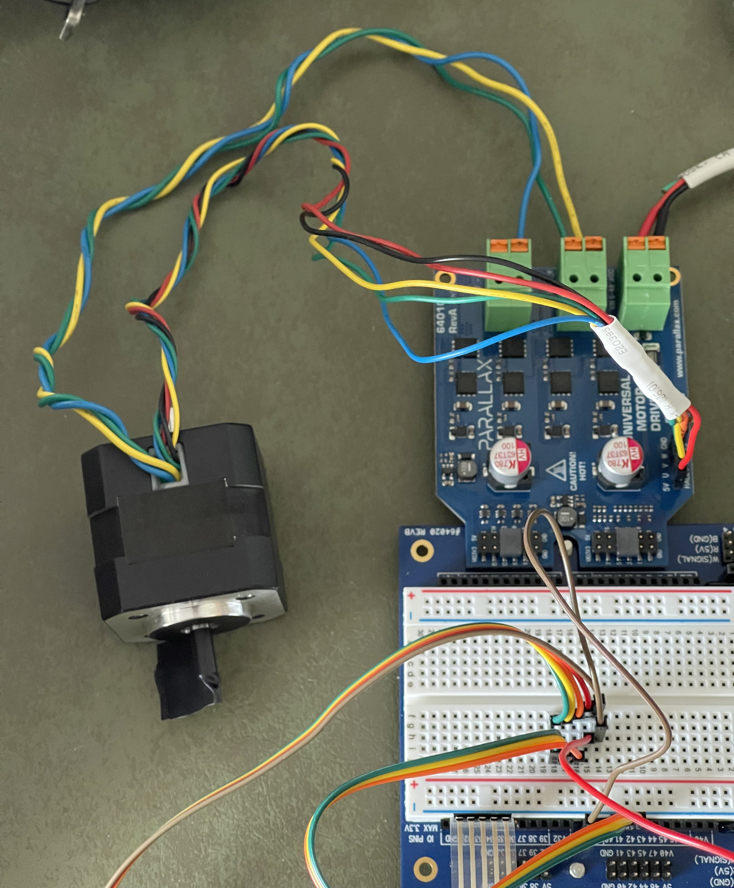

# P2-BLDC-Motor-Control - Adding support for a new motor

How to characterize a BLDC motor you want this driver to support, and where each result goes in the code.

![Project Maintenance][maintenance-shield]

[![License][license-shield]](LICENSE)

This page is a procedure. Each step says **what to measure**, **how**, and **where the result goes**. The
methods behind the steps are explained, with worked examples, in [TECHNIQUES.md](TECHNIQUES.md). The
[6.5″ motor technical manual](MOTOR-6.5IN-TECHNICAL-MANUAL.md) is a complete worked example: every
property this page asks you to measure is measured there, with the numbers we got.

## Motors Supported

| Category                   | 6.5″ hub motor (`MOTR_6_5_INCH`) | DocoEng 4k RPM 24 V (`MOTR_DOCO_4KRPM`) |
| -------------------------- | -------------------------------- | --------------------------------------- |
| Hall ticks per revolution  | 90                               | 24                                      |
| Degrees per hall tick      | 4°                               | 15°                                     |
| Ticks per hall cycle       | 6                                | 6                                       |
| Hall cycles per revolution | 15                               | 4                                       |
| Degrees per hall cycle     | 24°                              | 90°                                     |
| Magnets                    | 30 poles                         | 8 poles                                 |
| Delta table                | `deltas65`: position rises through 1-5-4-6-2-3 | `deltas4k`: the same steps          |
| Forward power drives       | positive increments              | negative increments                     |
| Commutation                | hall zero plus a lead that follows speed | one fixed offset each way, by voltage and board |

The top speed at each voltage, and the commutation each motor uses, are in the
[Motor Reference tables](MOTOR_CHOICE.md#motor-reference-top-speed-at-each-drive-voltage).

## Before you start

**What the driver needs to know about a motor.** The driver cannot discover any of these at run time, so
each one is compiled in:

1. its **geometry**: hall ticks per revolution and degrees per tick;
2. its **hall order** and the two tables that encode it;
3. its **commutation**: where to place the field relative to the halls;
4. its **speed limits** at each supply voltage;
5. a **name**.

**What you need.**

- **A Rev B 64010 board**, if you can. Finding the commutation means finding a current *minimum*, and Rev B
  reads current at 150 mV/A against Rev A's 5 mV/A. The hall zero (step 5a) can be measured on either.
- **The motor free to turn**: wheel lifted, or shaft unloaded, and clamped so it cannot walk.
- **The P2 at 270 MHz**, as every demo runs.
- **The debug terminal**, since these steps read the driver through `debug()` output.

**Two commutation models, and which one to start with.** The driver places the field in one of two ways:

- **A fixed pair** — one offset for each direction, chosen per supply voltage (and per board revision). This
  is how the DocoEng motor is driven. **Start here.** It needs no code beyond table entries, and step 5
  tells you how to find a good pair.
- **A hall zero plus a lead that follows speed** — how the 6.5″ motor is driven. It draws much less current
  across the speed range (24–78 % less than its best fixed pair). Today its constants (`HUB_HALL_ZERO_DEGR`,
  the lead table `leadIncrTbl` / `leadTenthsTbl`, the back-EMF line `HUB_FF_INCR_AT_NOMINAL`) serve the 6.5″
  motor only, and the lead schedule is switched on only for `MOTR_6_5_INCH`. Giving your motor this model
  means making those per-motor, which is a driver change and not only a table entry. Measure Z and L anyway
  (step 5): they tell you whether it is worth doing.

## Step 1 — Connect the motor

Wire the three hall sensors (with their power and ground) to the board's **Hall IN** header and the three
phases to **Motor out U, V, W**. If the colours don't tell you which is which, don't worry yet: step 4
finds the hall order, and a wrong phase order shows up the same way a wrong hall order does.

Here is how the DocoEng motor was connected (its [specifications are here](./DOCs/DOCOMotor.pdf)):

| Wire Color            | Purpose      | Adapter Wire Color           | board Connector |
| --------------------- | ------------ | ---------------------------- | --------------- |
| **Hall Sensor Wires** |              | _- 26 AWG wires (thinner) -_ |
| Red                   | +5V Hall Pwr | adapt Red                    | Hall IN: +v     |
| Yellow                | Hall U       | adapt Yellow                 | Hall IN: U      |
| Green                 | Hall V       | adapt Green                  | Hall IN: V      |
| Blue                  | Hall W       | adapt Orange                 | Hall IN: W      |
| Black                 | Ground       | adapt Brown                  | Hall IN: +v     |
| **Motor Drive Wires** |              | _- 20 AWG wires -_           |
| Yellow                | Phase U      | -no adapter-                 | Motor out U     |
| Green                 | Phase V      | -no adapter-                 | Motor out V     |
| Blue                  | Phase W      | -no adapter-                 | Motor out W     |

**FIGURE 1**: _This is the cabling per the table above._



**FIGURE 2**: _The new motor hooked up._



\*NOTE: the electrical tape "flag" makes it easy to count whole turns of the shaft (step 3).

## Step 2 — Name your motor

The motor identifiers are defined in one place: the list of supported motors in
`isp_bldc_motor_userconfig.spin2`. Choose a name that is specific enough for others to recognise the motor.

At the top of `isp_bldc_motor_userconfig.spin2`:

```spin2
' Names of supported Motors
#0, MOTR_6_5_INCH, MOTR_DOCO_4KRPM
```

becomes:

```spin2
' Names of supported Motors
#0, MOTR_6_5_INCH, MOTR_DOCO_4KRPM, {YOUR_NEW_MOTOR_IDENTIFER}
```

(replacing `{YOUR_NEW_MOTOR_IDENTIFER}` with your name).

The motor object, `isp_bldc_motor.spin2`, does not keep its own copy of this list. It re-exports each name
from the configuration file, so a program that uses only the motor object can still name the motors. Add one
line for your motor beside the existing ones at the top of `isp_bldc_motor.spin2`:

```spin2
    ' Names of supported Motors
    MOTR_6_5_INCH       = user.MOTR_6_5_INCH
    MOTR_DOCO_4KRPM     = user.MOTR_DOCO_4KRPM
    {YOUR_NEW_MOTOR_IDENTIFER} = user.{YOUR_NEW_MOTOR_IDENTIFER}
```

Because the value comes from the configuration file, the two can never disagree. Then add your name to
`validMotorForChoice()`'s list, so `start()` accepts it.

⚠ **Several routines choose between the two existing motors with `if … else`.** A new motor falls silently
into the `else` branch and inherits the other motor's values. The steps below name each routine; the
[checklist](#checklist--every-place-a-motor-is-named) at the end lists them all.

## Step 3 — Geometry: count revolutions by hand

**Measure** hall ticks per revolution. Don't take it from a datasheet, and don't infer it from a speed
reading: those checks divide by the number you are trying to confirm
([TECHNIQUES §1.1](TECHNIQUES.md#11-count-revolutions-by-hand-dont-calculate-them)).

**How.** Start the motor with no drive command, so the driver is reading the halls and nothing moves. Mark
the shaft, turn it a counted number of whole revolutions by hand, and read `getRawHallTicks()` before and
after. Ticks per revolution is the difference ÷ revolutions; degrees per tick is 360 ÷ that. Turn several
revolutions, not one, and check that the hall code at the end matches the code at the start.

**Worked example.** Three turns of the 6.5″ wheel: 270 ticks, so 90 per revolution and 4° per tick.

**Where it goes.** `hallTicInfoForMotor()` in `isp_bldc_motor.spin2` returns `degreesPerTic` and
`ticsPerRotation`. Turn its `if … else` into a `case` with a line for your motor.

**If it is wrong:** every speed, rotation and distance the driver reports is wrong by the same ratio.

## Step 4 — Hall order and the motor's tables

**Measure** the order in which the hall codes arrive when the motor turns forward
([TECHNIQUES §1.2](TECHNIQUES.md#12-the-hall-order-and-the-transition-table)).

**How.** With the driver not running, turn the shaft by hand in the direction you will call forward and
print the hall code, `pinread(basePin + 5 addpins 2)` (the three hall inputs, U, V, W, are pins 5 to 7 of
the motor's pin group). There are only two possible orders, `1-5-4-6-2-3` and `1-3-2-6-4-5`: one is the
other run backwards. Both of our motors use the same delta table, in which the position rises through
`1-5-4-6-2-3`. What differs is which way each maker's "forward" turns, and the driver takes that from the
sign of the forward increment (step 6), not from the table.

**Where it goes.** Each motor has two tables in `isp_bldc_motor.spin2`'s `DAT { MOTOR-TYPE TABLES }` block:

- an **angle table** (`hltbAngles`, `hltbAngl4k`): the rotor's angle within the hall cycle for each hall code,
  forward half then reverse half, 16 longs;
- a **delta table** (`deltas65`, `deltas4k`): the position step for each hall transition, 64 bytes indexed
  `(old << 3) | new`. **Every entry must be -1, 0 or +1.** The driver packs each step into two bits, so
  `start()` checks every motor's delta table before it launches anything, and refuses to start with
  `ERR_BAD_MOTOR_TABLE` (-1022) if any entry holds another value. A debug build also prints which motor and
  which entry.

If your motor uses the same order as one of ours, reuse that motor's pair of tables. Then add your motor in
three places:

1. **`init()`** copies the angle table for the configured motor. Today it chooses between the two motors
   like this:

    ```spin2
        ' new build up our hall angle and position increment table for specific motor
        if user.MOTOR_TYPE == MOTR_6_5_INCH
            longmove(@hall_angles, @hltbAngles, 16)
        else
            longmove(@hall_angles, @hltbAngl4k, 16)
    ```

    Turn it into a `case` on `user.MOTOR_TYPE` with a line for your motor's angle table.

2. **`deltaTableForMotor()`** returns the delta table for a motor type. Add a case for your motor's table:

    ```spin2
        case eMotorType                                     ' the same choice as init()'s angle table
            MOTR_6_5_INCH:
                pDeltaBytes := @deltas65
            other:
                pDeltaBytes := @deltas4k
    ```

    `init()` hands this table to `packHallDeltas()`, which builds the driver's packed copy. You never write the
    packed form yourself.

3. **`bHallDeltaTablesValid()`** checks the delta table of every motor type from `MOTR_6_5_INCH` to the last
   one. Extend its range to your motor:

    ```spin2
        repeat eMotorType from MOTR_6_5_INCH to MOTR_DOCO_4KRPM
    ```

    Change `MOTR_DOCO_4KRPM` to your new identifier, so your table is checked at every start.

**If it is wrong:** the motor won't turn, or moves a little and stops, or runs in one direction only. Once
the motor runs, `getHallIntegrityCounts()` should report no missed transitions and no illegal codes.

## Step 5 — Commutation: where to place the field

This is the step that matters most. On the 6.5″ motor, being 30° away from the best placement costs **12.7
times** the current, and it is circulating current that does no work and only heats the board. Read
[TECHNIQUES §1.3–§1.5](TECHNIQUES.md#13-find-the-hall-zero-from-the-two-directions-current-minima) before
you start.

**Start safely.** Begin at a low speed, with a current limit you are comfortable with, and expect some
offsets to fault. That is how the edges of the usable window show up.

### 5a — The hall zero (Z)

**Measure** where the hall pattern's zero sits against true electrical zero. There are two independent
ways, and you should use both:

- **From the two current minima.** At one moderate speed, sweep the offset in each direction and record net
  current at each step. Z is the midpoint of the two directions' minima. Repeat at twice the speed: **Z must
  not move with speed**, and if it does, something in the measurement is wrong.
  `src/test_bench_scan.spin2` does this unattended.
- **Cold, from back-EMF.** Coast the bridge and turn the shaft by hand in both directions. The phase voltages
  are the motor's own waves, fixed to the magnets. This needs no current resolution, so it works on a Rev A
  board too. The `dual-align` tier of `src/test_bench_dual.spin2` does this.

**Worked example.** Z = −4° on the 6.5″ motor: −3.8° and −4.0° by the minima, −3.31° and −3.25° cold.

### 5b — The lead (L), at several speeds

**Measure** how far ahead of the rotor the field should sit, at three or four speeds one octave apart.
Record the region where current stays low, not only the single lowest point, and pick a value inside it.

**Worked example.** On the 6.5″ motor the best lead **falls** with speed, from about 20° at a crawl to 5–8°
from a quarter of top speed upward. That is the opposite of the textbook model, so measure it.

### 5c — Put it in the driver

With the **fixed-pair model**, the pair is `Z + L` for negative increments and `Z − L` for positive ones,
using the L of the speed you will run at most:

```spin2
    ' configure our offsets for specific motor
    fwdDegrees, revDegrees := offsetsForMotor(user.MOTOR_TYPE)
```

Add a case for your motor to **`offsetsForMotor()`**, returning `fwdDegrees` and `revDegrees`. The DocoEng
case shows how to vary the pair by supply voltage and board revision; note that its pair is symmetric about
zero, which is only right if the motor's Z is 0. Build the pair from Z and L, as the 6.5″ case does, so an
asymmetric pair can be expressed.

If the lead you measured changes a lot with speed, that is the case for the second model: note it when you
share your results.

**If it is wrong:** at worst the motor won't turn or faults at once. More often it runs, drawing one or two
orders of magnitude more current than it needs, or more in one direction than the other. If a two-wheel
platform draws more on one side than the other, suspect the commutation first.

## Step 6 — Speed limits at each voltage

**Measure** the fastest speed that keeps a duty reserve (the **ceiling**) and the slowest that still turns
steadily (the **floor**) ([TECHNIQUES §1.6](TECHNIQUES.md#16-choose-the-speed-ceiling-by-duty-reserve-not-by-where-the-motor-gives-up)).

**How.** At your supply voltage, step the commanded speed up on the unloaded motor, recording duty against
its ceiling and current. Duty reaches its ceiling at a **knee**. Above it, the motor may keep following by
field weakening, drawing much more current and able to slip. Set the ceiling below the knee, where duty
still has about 7 % in hand. Step down to find the floor.

`power` 100 commands the ceiling. A motor asked to go faster than it can sustain holds the fastest speed it
can, drawing more current as it tries.

**Worked example.** The 6.5″ motor at 18.5 V: knee at 175–185 × 10⁶, ceiling 165 × 10⁶ (294 RPM), with every
speed down to 100,000 turning steadily. Its other voltages' ceilings are that one number scaled by voltage,
which our earlier per-voltage measurements followed to within 2.5 %.

**Where it goes.**

- **`powerTableIndex()`** lists the voltages your motor has a row for; `start()` refuses any other.
- **`confgurePowerLimits()`** sets `maxFwdIncreAtPwr` / `maxRevIncreAtPwr` (the ceiling) and
  `minFwdIncreAtPwr` / `minRevIncreAtPwr` (the floor) for each voltage. The DocoEng case shows a table per
  voltage (and per board revision); the 6.5″ case shows one measured ceiling scaled by voltage. **The sign of
  `maxFwdIncreAtPwr` sets which increment sign is "forward"**: the DocoEng motor's is negative.
- The increment must stay below 2³⁰ (1,073,741,823) in magnitude, or it reads back as negative and the motor
  runs the wrong way.
- **`init()`** sets the feedforward's scale, `ff_ceiling`: the 6.5″ motor uses its measured back-EMF line, and
  any other motor uses its ceiling.

## Step 7 — Check the result

Run the motor through its range in both directions and check:

- **the start checks pass** (`start()` returns `NO_ERROR`; `getHealth()` reports nothing failed);
- **no hall trouble** (`getHallIntegrityCounts()` stays at zero);
- **both directions draw about the same current** at the same speed, which is the sign that the commutation
  is centred on Z;
- **it stops the way you expect** in each stop mode, and in the fault response you will use
  ([TECHNIQUES §1.8](TECHNIQUES.md#18-characterize-how-it-stops-not-only-how-it-runs));
- **the speed and distance you command are what you get**: turn the wheel a known distance by command and
  measure it.

For each check, also make it fail once on purpose. A check you have only seen pass hasn't been tested
([TECHNIQUES §2.1](TECHNIQUES.md#21-a-check-that-cannot-fail-proves-nothing--measure-the-negative-case)).

## Step 8 — Record and share

Add your motor's rows to the [Motor Reference tables](MOTOR_CHOICE.md#motor-reference-top-speed-at-each-drive-voltage)
(top speed at each voltage, and its commutation), marking which rows you verified on your hardware. Say what
you measured and how, in the same terms as the [6.5″ manual](MOTOR-6.5IN-TECHNICAL-MANUAL.md): measured,
calculated, or taken from the vendor.

Then please share what you've learned! See [Contributing](CONTRIBUTING.md) for how to send us your changes,
so we can keep growing the set of motors this driver supports.

## Checklist — every place a motor is named

| Where | What to add |
| ----- | ----------- |
| `isp_bldc_motor_userconfig.spin2`, motor list | your `MOTR_*` name (step 2) |
| `isp_bldc_motor.spin2`, `CON` at the top | the re-export of your name (step 2) |
| `validMotorForChoice()` | your name in its list (step 2) |
| `hallTicInfoForMotor()` | degrees per tick, ticks per revolution (step 3) |
| `DAT { MOTOR-TYPE TABLES }` | your angle and delta tables, unless you reuse ours (step 4) |
| `init()`, angle table | your case (step 4) |
| `deltaTableForMotor()` | your case (step 4) |
| `bHallDeltaTablesValid()` | the loop's range, to your name (step 4) |
| `offsetsForMotor()` | your commutation pair (step 5) |
| `powerTableIndex()` | your voltages (step 6) |
| `confgurePowerLimits()` | your ceiling and floor per voltage (step 6) |
| `init()`, `ff_ceiling` | only if your motor has a measured back-EMF line (step 6) |
| `MOTOR_CHOICE.md` | your reference rows (step 8) |

A good check that you have them all: search `isp_bldc_motor.spin2` for `MOTR_DOCO_4KRPM` and for
`MOTR_6_5_INCH`. Every match is a place that decides between motors.

**About the bench programs.** `src/test_bench_*.spin2` are the programs we measured the 6.5″ motor with. They
build through `tools/bench-run.sh` against `isp_bldc_motor_userconfig_bench.spin2`, which describes our
bench: two 6.5″ motors on Rev B boards. To use them on your motor, set your motor and voltage in that file.
Their speed steps are sized for the 6.5″ motor (`DRIVE_CEILING_INCRE` and the increments derived from it),
so scale them to your motor's ceiling first. Each program's header says what it measures.

---

> If you like my work and/or this has helped you in some way then feel free to help me out for a couple of :coffee:'s or :pizza: slices!
>
> [](https://www.buymeacoffee.com/ironsheep) &nbsp;&nbsp; -OR- &nbsp;&nbsp; [](https://www.patreon.com/IronSheep?fan_landing=true)[Patreon.com/IronSheep](https://www.patreon.com/IronSheep?fan_landing=true)

---

## Disclaimer and Legal

> _Parallax, Propeller Spin, and the Parallax and Propeller Hat logos_ are trademarks of Parallax Inc., dba Parallax Semiconductor

---

## License

Licensed under the MIT License.

Follow these links for more information:

### [Copyright](copyright) | [License](LICENSE)

[maintenance-shield]: https://img.shields.io/badge/maintainer-stephen%40ironsheep%2ebiz-blue.svg?style=for-the-badge

[license-shield]: https://img.shields.io/badge/License-MIT-yellow.svg
