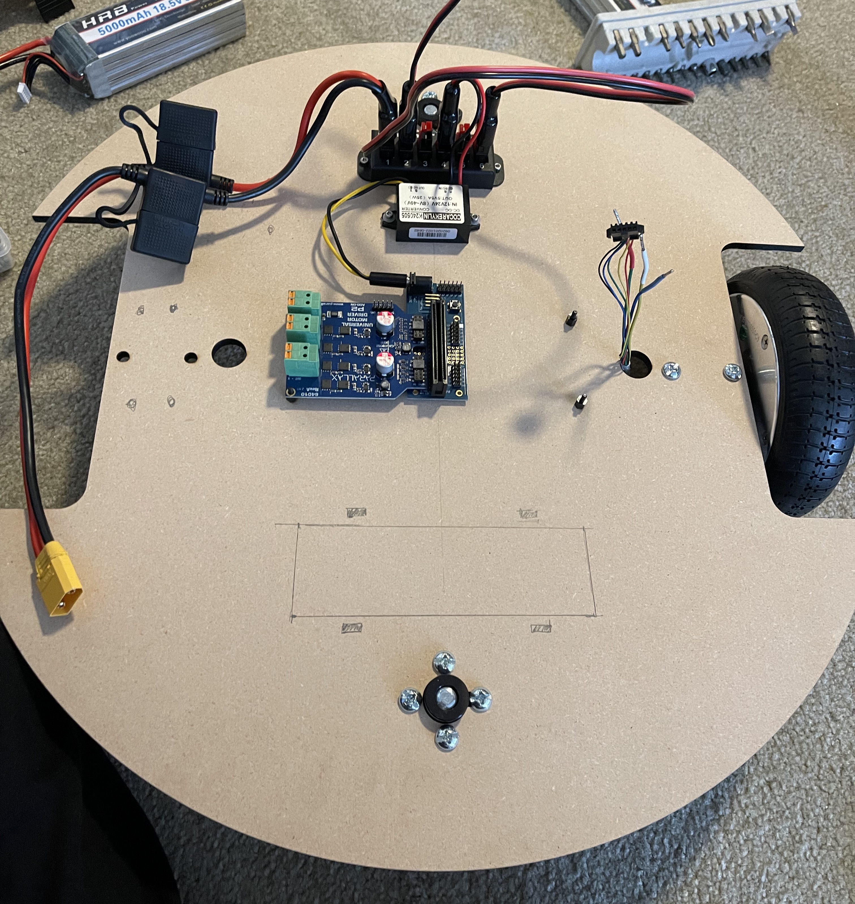
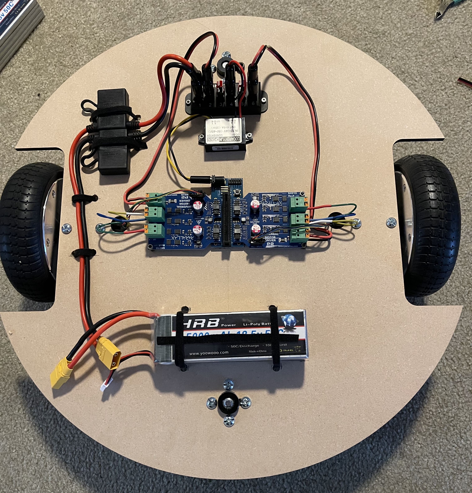
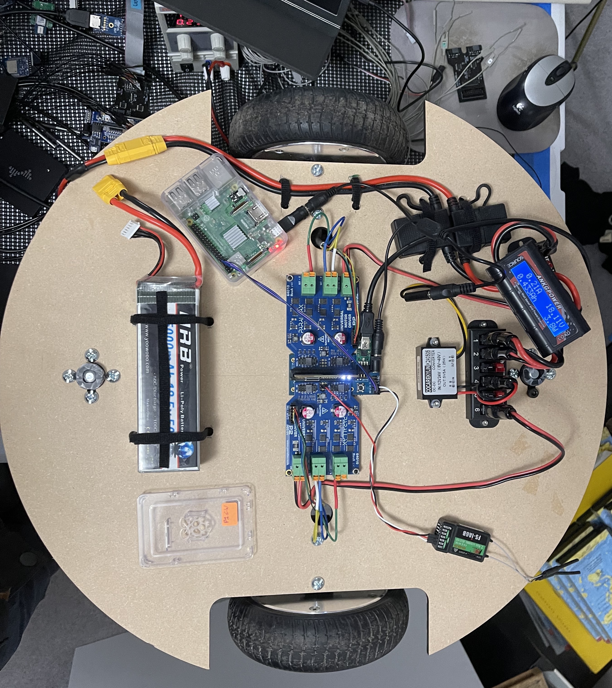

# P2-BLDC-Motor-Control - The Authors' Test Platform
as I work on these drivers I need to use a test platform.  This page describes what my platofrm looks like and how it is set up.

![Project Maintenance][maintenance-shield]

[![License][license-shield]](LICENSE)

## Images of my Platform

I decided to use the inset wheels design (See [Drawings](DRAWINGS.md)) for mine and ordered it from [SendCutSend.com](https://sendcutsend.com/). I ordered a bunch of the spacers too. The order arrived like this:

You can see there are a number of predrilled holes for screws, castors, and cable feed through for the motor cables:

- The 4 center small holes (for M3 screws) are for mounting the twin motors boards connected to the Mini Edge Breakout Board. 
-  2 ea. holes for each motor (for 1/4" - 20 Screws.)
-  2x - 4 ea. holes for each castor - (for 1/4" - 20 Screws.)
-  2x - 2 ea. holes for each spacer board (shim) (for 1/4" - 20 Screws.)

---

After unboxing the parts need to be mounted:

The pencil marks show where I drilled additional holes as I determined what additional parts I needed to mount.

---

The finished platform looks like this:

Here are links to key parts I used:

- [HRB 5S 18.5V 5000mAh 50-100C RC Lipo Battery](https://www.amazon.com/HRB-5000mAh-50-100C-Battery-T-REX550/dp/B06XP7TY3S) - Amazon
- [6-Position 45A Power Pole Distribution Block](https://www.amazon.com/Chunzehui-6-Position-Distribution-Connector-Distributor/dp/B07KQD9V3G) - Amazon
- [DC 12v 24v to 5v Step Down Converter Regulator 5A 25W](https://www.amazon.com/Converter-Regulator-Adapter-Reducer-Electronics/dp/B07Q5W1BG3) - Amazon - Added Anderson power-pole connector on input side and N barrel plug on output side.
- [150A Power Analyzer, High Precision RC with Digital LCD Screen](https://www.amazon.com/ANKG-Precision-Measurement-Connectors-connected/dp/B07YF393ZH) - Amazon, LCD screen shows V, A, W, Ah, Wh measurements
- [Inline Blade-Fuse Holders](https://www.amazon.com/iGreely-Terminals-Connectors-Automotive-Compatible/dp/B07ST82H9H) - Amazon, Replaced ring-terminal ends with XT90 socket to mate with battery

**Castors** Special Note: the set screws tend to come lose with vibration. I was driving on gravel.  So use loctite or something similar to hold them in place if you don't want castors falling off as your are driving.

---

And here I'm running tests of the FlySky remote control demo. (Of course, running on the test-bench required an empty amazon box.   ;-)

---

Here's an updated bech-setup with the RPi in the drivers' seat!

**NOTE:** the nVolt to 5V DC step-down supply was chosen so that I can power the P2 as well as the RPi from the same 5v. This picture shows me using a Y-splitter on the 5v with the two legs then feeding the P2 and the RPi.

---

> If you like my work and/or this has helped you in some way then feel free to help me out for a couple of :coffee:'s or :pizza: slices!
>
>  &nbsp;&nbsp; -OR- &nbsp;&nbsp; [Patreon.com/IronSheep](https://www.patreon.com/IronSheep?fan_landing=true)

---

## Disclaimer and Legal

> *Parallax, Propeller Spin, and the Parallax and Propeller Hat logos* are trademarks of Parallax Inc., dba Parallax Semiconductor

---

## License

Copyright © 2022 Iron Sheep Productions, LLC. All rights reserved.

Licensed under the MIT License.

Follow these links for more information:

### [Copyright](copyright) | [License](LICENSE)

[maintenance-shield]: https://img.shields.io/badge/maintainer-stephen%40ironsheep%2ebiz-blue.svg?style=for-the-badge

[marketplace-version]: https://vsmarketplacebadge.apphb.com/version-short/ironsheepproductionsllc.spin2.svg

[marketplace-installs]: https://vsmarketplacebadge.apphb.com/installs-short/ironsheepproductionsllc.spin2.svg

[marketplace-rating]: https://vsmarketplacebadge.apphb.com/rating-short/ironsheepproductionsllc.spin2.svg

[license-shield]: https://camo.githubusercontent.com/bc04f96d911ea5f6e3b00e44fc0731ea74c8e1e9/68747470733a2f2f696d672e736869656c64732e696f2f6769746875622f6c6963656e73652f69616e74726963682f746578742d646976696465722d726f772e7376673f7374796c653d666f722d7468652d6261646765
