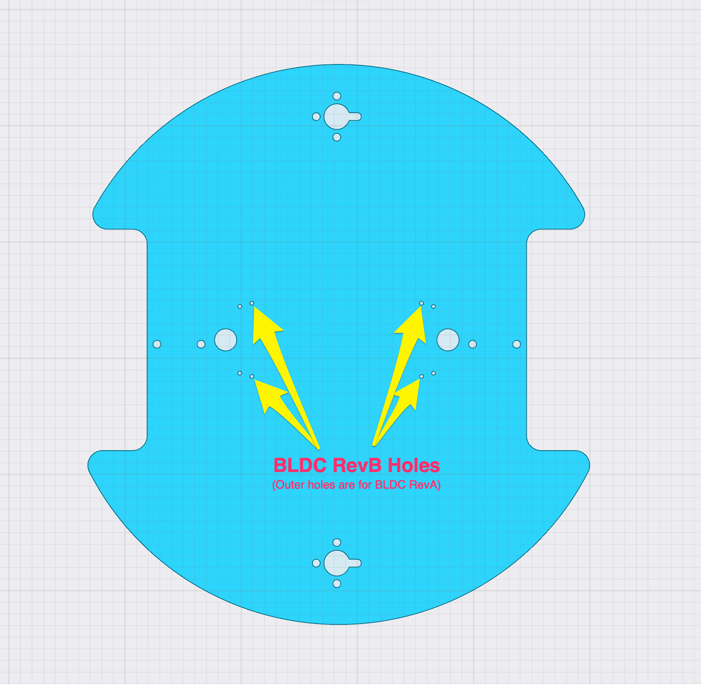
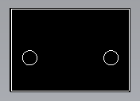
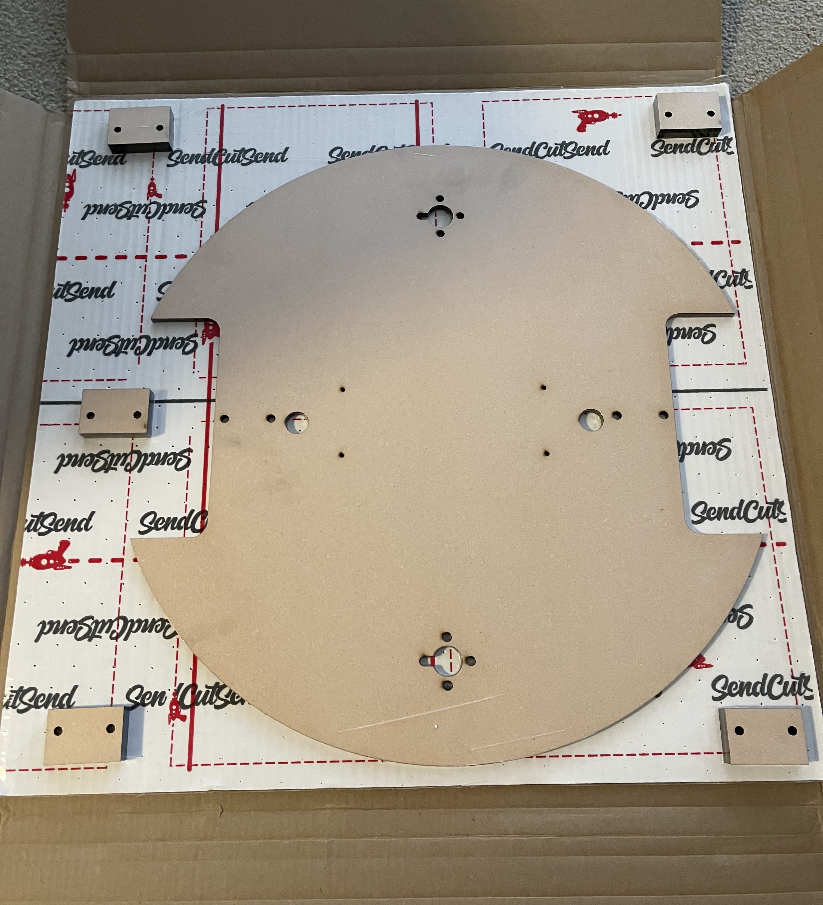
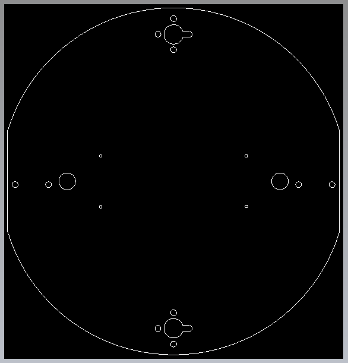
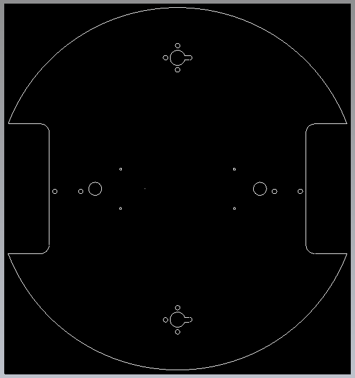

# P2-BLDC-Motor-Control - DRAWINGs

Single and Two-motor driver objects P2 Spin2/Pasm2 for our 6.5" Hub Motors with Universal Motor Driver Board

![Project Maintenance][maintenance-shield]

[![License][license-shield]](LICENSE)

### Drawing Files

These are the two design files I sent off to be make by [SendCutSend.com](https://sendcutsend.com/) - their prices are quite good!:

#### 1. Platform Board

[Drawing File - outboard wheels (.dwg)](DOCs/DesignFiles/EdgeMiniRoundV3b.dwg) - I spec'd 0.250" MDF as the material at ~$29 USD. 

NOTE: the 8 center small holes (for M3 screws) are for mounting the twin motor boards connected to the **Mini Edge Breakout Board** (#64019) or the newer **Edge Breakout Board** (#64029).  The inner-most 4 holes are for the new, smaller RevB boards, while the outer four are for the larger RevA motor boards.

There are 2 ea. holes for each motor (for 1/4" - 20 Screws.)

There are 4 ea. holes for each castor - (for 1/4" - 20 Screws.)

There are 2 ea. holes for each spacer board (shim) (for 1/4" - 20 Screws.)

#### 2. Spacer Board

[Drawing File - spacer to drop motors below castors (.dwg)](DOCs/DesignFiles/SpacerV1.dwg) - I spec'd 0.025" MDF as the material w/Ten of these for ~$14.20 USD. 

### Packaging (order arrives)

This is what I found when I opened my order:

**The Package arrived with these contents..**  This was quite well packaged. The MDF part was shrink-wrapped to the backing cardboard. The laser cuts were all clean with a little bit of scorch mark on one side of the MDF as you might expect. 

---

> If you like my work and/or this has helped you in some way then feel free to help me out for a couple of :coffee:'s or :pizza: slices!
>
>  &nbsp;&nbsp; -OR- &nbsp;&nbsp; [Patreon.com/IronSheep](https://www.patreon.com/IronSheep?fan_landing=true)

---

## Older Drawing Files

These are my earlier designs including the version you see in the pictures above.

1. **OLD:** [Drawing File - outboard wheels (.dwg)](DOCs/DesignFiles/EdgeMiniRoundV1.dwg) - I spec'd 0.250" MDF as the material at ~$29 USD. 

1. **OLD:** [Drawing File - enclosed wheels (.dwg)](DOCs/DesignFiles/EdgeMiniRoundV2_encl.dwg) - I spec'd 0.250" MDF as the material at ~$29 USD. 

## Disclaimer and Legal

> *Parallax, Propeller Spin, and the Parallax and Propeller Hat logos* are trademarks of Parallax Inc., dba Parallax Semiconductor

---

## License

Copyright © 2022 Iron Sheep Productions, LLC. All rights reserved.

Licensed under the MIT License.

Follow these links for more information:

### [Copyright](copyright) | [License](LICENSE)

[maintenance-shield]: https://img.shields.io/badge/maintainer-stephen%40ironsheep%2ebiz-blue.svg?style=for-the-badge

[license-shield]: https://camo.githubusercontent.com/bc04f96d911ea5f6e3b00e44fc0731ea74c8e1e9/68747470733a2f2f696d672e736869656c64732e696f2f6769746875622f6c6963656e73652f69616e74726963682f746578742d646976696465722d726f772e7376673f7374796c653d666f722d7468652d6261646765

