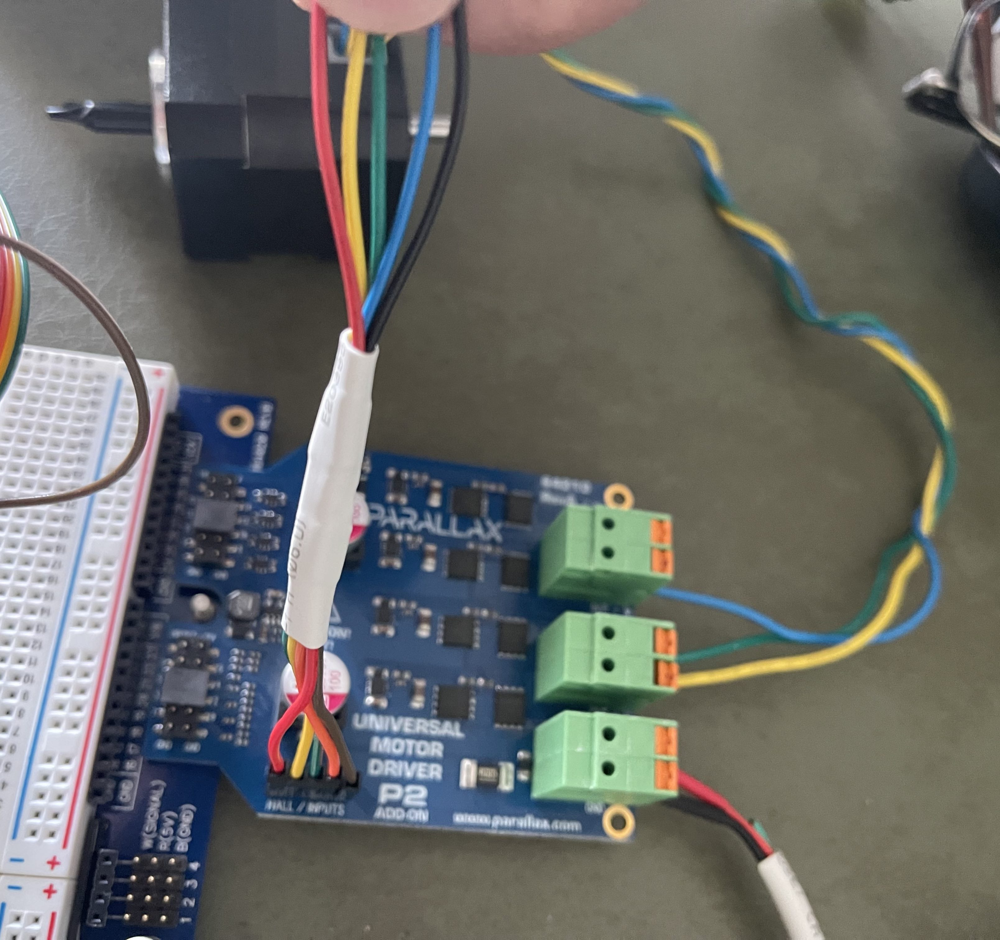
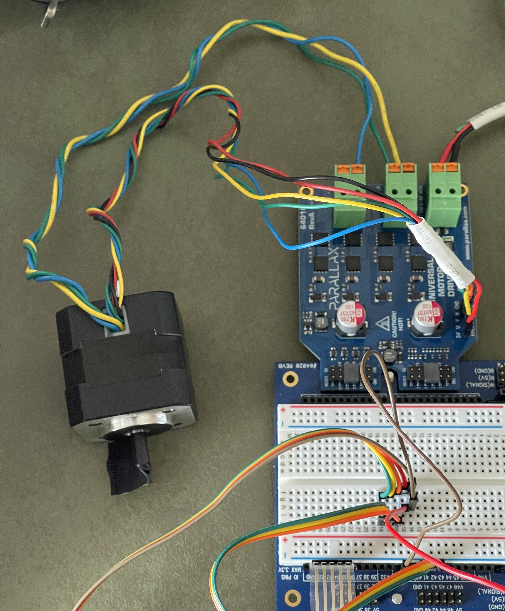

# P2-BLDC-Motor-Control - Adding support for a new motor

We just had the occasion to add support for a new BLDC Motor.  This page helps us remember what we need to do to qualify the new motor.

![Project Maintenance][maintenance-shield]

[![License][license-shield]](LICENSE)

## Motors Supported

The motor currently supported by this driver (at the time of this writing):

| Category | Value | Description |
| --- | --- | --- |
| **-- 6.5" Wheel --** || the Parallax Hoverboard-like motors
| Hall Tics per Revolution | 90 ticks | 
| Degrees per hall tick | 4 degrees
| Ticks per hall-cycle | 6 ticks | FWD 110 -> 100 -> 101 -> 010 -> 100 -> 101 -or- 001 -> 101 -> 100 -> 110 -> 010 -> 011 etc.
| Hall-cycles per Revolution | 15 hall-cycles |
| Degrees per Hall-cycle | 24 degrees |

The new Motor we're adding:

| Category | Value | Description |
| --- | --- | --- |
| **-- docoEng.com 4k RPM 24v motor --** || the new Parallax small motor
| Hall Tics per Revolution | 24 ticks | 
| Degrees per hall tick | 15 degrees
| Ticks per hall-cycle | 6 ticks | FWD: 1-5-4-6-2-3 REV: 1-3-2-6-4-5
| Hall-cycles per Revolution | 4 hall-cycles |
| Degrees per Hall-cycle | 90 degrees |

## Cabling of new Motor

We're adding the DocoEng.com BLDC motor - 4,000 RPM, 24V to the driver. The motor [specifications are here](./DOCs/DOCOMotor.pdf). These are the connections I used. I ended up cutting off the end of some female connector wires and soldering them to the motor wires to make a connector. While most of use would simply solder on connectors, I was on a road trip and this is what I had access to. ;-) 

| Wire Color | Purpose | Adapter Wire Color | board Connector |
| --- | --- | --- | --- |
| **Hall Sensor Wires** | | *- 26 AWG wires (thinner) -*
| Red | +5V Hall Pwr | adapt Red | Hall IN: +v
| Yellow | Hall U | adapt Yellow | Hall IN: U
| Green | Hall V | adapt Green  | Hall IN: V
| Blue | Hall W | adapt Orange  | Hall IN: W
| Black | Ground | adapt Brown  | Hall IN: +v
| **Motor Drive Wires** | | *- 20 AWG wires -*
| Yellow | Phase U | -no adapter- | Motor out U
| Green | Phase V | -no adapter- | Motor out V
| Blue | Phase W | -no adapter- | Motor out W

**FIGURE 1**: *This is the cabling per the table above.*

**FIGURE 2**: *The new motor hooked up.*

*NOTE: the electrical tape "flag" so i can tell relative position of shaft during movement.

## Process of adding a new motor

- Determine geometry of motor
- Validate hall sequence
- Add new enum value for motor
- Add hall tables for new sequence if needed
- Associate tables with new motor constant (creating new tables if needed)
- Determine new fwd/rev offset constants that yield lowest current draw at fixed speed/rpm
- Adjust motor position sense code to new motor hall geometry so rotation positon tracking are correct for the motor

## Wrapup

This is where I have gotten to at the moment. I'm not quite done with the adjustments to the driver to support this new motor.

As I complete the adjustments, if I find anything here I missed I'll update this list.

-Stephen
(last updated 27: June 2022)

---

> If you like my work and/or this has helped you in some way then feel free to help me out for a couple of :coffee:'s or :pizza: slices!
>
>  &nbsp;&nbsp; -OR- &nbsp;&nbsp; [Patreon.com/IronSheep](https://www.patreon.com/IronSheep?fan_landing=true)

---

## Disclaimer and Legal

> *Parallax, Propeller Spin, and the Parallax and Propeller Hat logos* are trademarks of Parallax Inc., dba Parallax Semiconductor

---

## License

Copyright © 2022 Iron Sheep Productions, LLC. All rights reserved.

Licensed under the MIT License.

Follow these links for more information:

### [Copyright](copyright) | [License](LICENSE)

[maintenance-shield]: https://img.shields.io/badge/maintainer-stephen%40ironsheep%2ebiz-blue.svg?style=for-the-badge

[marketplace-version]: https://vsmarketplacebadge.apphb.com/version-short/ironsheepproductionsllc.spin2.svg

[marketplace-installs]: https://vsmarketplacebadge.apphb.com/installs-short/ironsheepproductionsllc.spin2.svg

[marketplace-rating]: https://vsmarketplacebadge.apphb.com/rating-short/ironsheepproductionsllc.spin2.svg

[license-shield]: https://camo.githubusercontent.com/bc04f96d911ea5f6e3b00e44fc0731ea74c8e1e9/68747470733a2f2f696d672e736869656c64732e696f2f6769746875622f6c6963656e73652f69616e74726963682f746578742d646976696465722d726f772e7376673f7374796c653d666f722d7468652d6261646765
