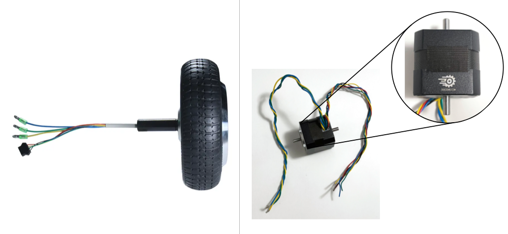
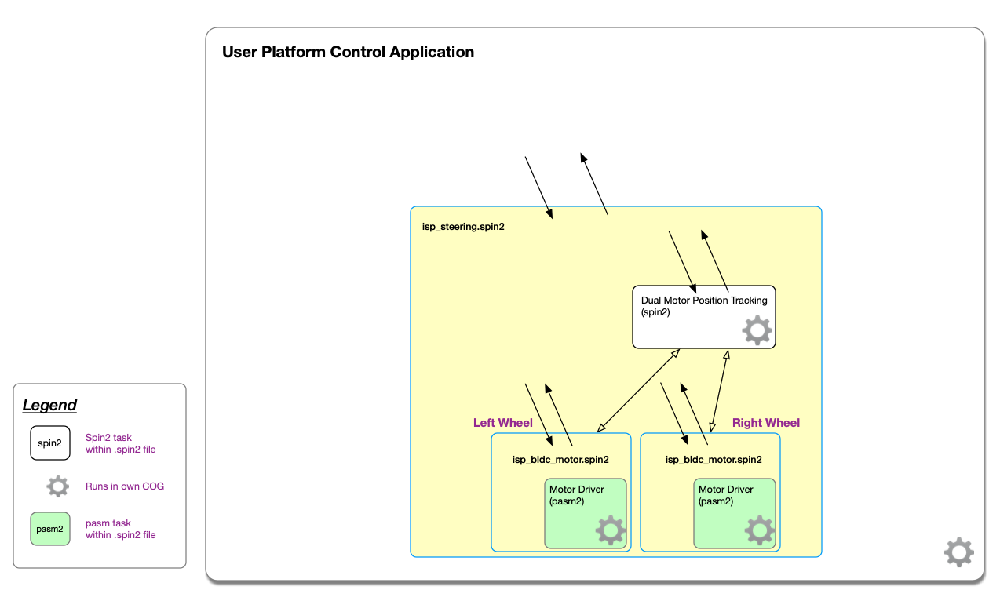

# P2-BLDC-Motor-Control - README
Single and Two-motor driver objects P2 Spin2/Pasm2 for our 6.5" Hub Motors with Universal Motor Driver Board

![Project Maintenance][maintenance-shield]

[![License][license-shield]](LICENSE)


## The Project

Provide ready-to-use objects easily incorporated into your own code which control Brushless DC  (BLDC) motors via the [Parallax 64010 Universal Motor Driver P2 Add-on Boards](https://www.parallax.com/product/universal-motor-driver-p2-add-on-board/)  These boards can be used with any of the following boards:

| Board | Features 
| --- | --- |
| [Parallax 64020 P2 Edge Module Breadboard](https://www.parallax.com/product/p2-edge-module-breadboard/) | larger size, solder-free prototyping area, 4 12-pin header pairs
| [Parallax 64029 P2 Edge Breakout Board](https://www.parallax.com/product/p2-edge-breakout-board/) | medium size, NO solder-free prototyping area, 4 12-pin header pairs <br><br>(**Recommended for mobile platforms** *unless you need smaller form factor of Mini Edge 64019 and not using the extra pins provided by this board*)
| [Parallax 64019 P2 Edge Mini Breakout Board](https://www.parallax.com/product/p2-edge-mini-breakout-board/) | smaller, only 2 12-pin header pairs plus an extra 12-pn header (partially used)<br><br>(**Alternate recommendation for mobile platforms** *if you have less space and use fewer pins*)
| [Parallax 64000 Propeller 2 Evaluation Board (Rev C)](https://www.parallax.com/product/propeller-2-evaluation-board-rev-c/) |medium size, NO solder-free prototyping area, 4 12-pin header pairs

NOTE: *If you wish to add more than a couple of sensors to your mobile platform then you'll want to use the larger 64029 P2 Edge Breakout board as it provides more pins for connecting your additonal sensors.*

Parallax offers a pair of the [6.5" Hoverboard wheels along with mounting hardware](https://www.parallax.com/product/6-5-hub-motors-with-encoders-and-mounting-blocks-bundle/) which is perfect for use with the drivers from this project.

A new smaller higher RPM motor is also available from Parallax that works with this driver. [SKU 750-90020](https://www.parallax.com/product/motor-bldc-24v-4000-rpm/)

This post [Build a Heavy-Duty Robot Using 6.5″ Hub Motors and Propeller 2 Control System](https://www.parallax.com/build-a-heavy-duty-robot-using-brushless-dc-motors/) describes our two-wheel system. The objects provided by this project are all you need to get your platform moving!  

**Serial Control:** If you wish to use an Arduino or Rapspberry Pi to control your **BLDC Motor platform** then head over to our: [Serial Control Page](SERIAL-CONTROL.md) for example instructions using a Raspberry Pi.

## Two Motors now Supported

This driver now supports the smaller BLDC motor from DocoEng.com sold by parallax.com in addition to the 6.5" Hub Motor w/Encoder.



**FIGURE:** &nbsp;&nbsp;LEFT: 6.5" hub motor [SKU 27860](https://www.parallax.com/product/6-5-hub-motor-with-encoder/) &nbsp;&nbsp;|&nbsp;&nbsp; RIGHT: new smaller motor with DocoEng.com label. [SKU 750-90020](https://www.parallax.com/product/motor-bldc-24v-4000-rpm/)

See also:

- [How to select the motor in your project code](MOTOR_CHOICE.md) - has motor reference info
- [Connecting the smaller motor](DOCOENG_MOTOR.md) - wiring information


## Current status

Latest Changes:

```
11 August 2023
- fix 2-wheel steering object
10 April 2023
- Completing RevB board support for both motors
12 March 2023
- Add new demo Dual-motor w/FlySky and HDMI debug out - used when upgrading dual wheel behavior
10 March 2023
- Add FlySky Receiver wiring descriptions
16 August 2022  v3.0.0
- Final cleanup, documentation update for new motor capability
15 August 2022
- Finished re-characteriation of DocoEng motor, limits in code revised.
12 August 2022
- Found and fixed bug in the PWM generation! Now have better top-end to motor drive!
1-5 August 2022
- Improve resolution of single drive position sense loop
- Adjust top-end constants for DocoEng motor (after more characterization)
7 July 2022 V2.1.0
- Release initial support for the DocoEng.com smaller 24v 4,000 RPM motor
2 July 2022
- Small motor working well
- Finished first pass at characterization of limits
- Same voltages now supported as the 6.5" in-wheel motor
27 June 2022
- Forward working reasonably well
- Reverse is not yet working...
21 June 2022
- Adding support for 2nd BLDC Motor - from DocoEng.com - 4000 RPM, 24v
04 May 2022 v2.0.0
- Add new Serial Top-Level object as interface to 2-wheel steering object. 
  -- Drive your platform from RPi or Arduino (RPi example provided)
- Fixed issues with position tracking and reporting within isp_steering_2wheel.spin2
27 Apr 2022 v1.1.0
- Add emergency stop methods to isp_bldc_motor.spin2, and isp_steering_2wheel.spin2
- Adjust spin-up ramp to start slower then speed up (better traction on loose surfaces but faster speed-up as well.)
- Add FlySky control mapping info to this README
- Map FlySky SwD to emergency stop!
02 Apr 2022  v1.0.1
- Initial Public Release
```

## Known Issues

Things we know about that still need attention:

```
v4.1.0
- Calculation of current and power not yet correct.
v4.0.0
- Calculation of current and power not yet correct.
- BUG in isp_steering_2wheel.spin2 (validDetectModeForChoice() calling incorrect underlying method
v3.0.0
- Drive status reporting is not working in base objects so is also reported badly over serial I/F
- Motor can fault at higher load conditions (we need to add a fallback algortihm so motor doesn't "give up" under load
v2.0.0
- Drive status reporting is not working in base objects so is also reported badly over serial I/F
- Motor can fault at higher load conditions (we need to add a fallback algortihm so motor doesn't "give up" under load
v1.1.0
- Issues with position tracking not working in isp_steering_2wheel.spin2
- Drive status reporting is not working in base objects (motor and steering)
```

## Table of Contents

On this Page:

- [Motor Object Introduction](https://github.com/ironsheep/P2-BLDC-Motor-Control#single-and-two-wheeled-motor-control-objects) - An overview of the objects provided by this project
- [System Diagram](https://github.com/ironsheep/P2-BLDC-Motor-Control#system-diagram) - A quick visual overview of the motor and steering runtime structure
- [Future Directions](https://github.com/ironsheep/P2-BLDC-Motor-Control#future-directions) - Notes about areas we can improve over time if you have experience and want to help us with these, please contact us in Forums [(in this thread)](https://forums.parallax.com/discussion/174516/universal-motor-driver-dual-wheel-steering-motor-control-and-position-tracking-objects-for-p2#latest)
- [DEMOs](https://github.com/ironsheep/P2-BLDC-Motor-Control#demos) - Example files that show how to interact with the motor control and steering objects provided by this project
- [FlySky Controls for DEMO](https://github.com/ironsheep/P2-BLDC-Motor-Control#flysky-controls-for-demo) - How our Switches and Joysticks are tasked
- [Reference](https://github.com/ironsheep/P2-BLDC-Motor-Control#references) - We looked at a number of control systems before deciding on the public interfaces for our steering and motor control objects
- [How to Contribute](https://github.com/ironsheep/P2-BLDC-Motor-Control#how-to-contribute) - We welcome contributions back to this project for all of us to use. Learn how, here!

Additional pages:

- [Steering and Motor control](DRIVE-OBJECTS.md) - The object public interfaces
- [Start your drive project using these objects](DEVELOP.md) - Walks thru configuration and setup of your own project using these objects
- [Use RPi or Arduino to control your platform](SERIAL-CONTROL.md) - Walks thru configuration and setup of RPi control system (extrapolate to Arduino)
- [Drawings](DRAWINGS.md) - Files (.dwg) that you can use to order your own platform inexpensively
- [To-scale drawings](DOCs/bot-layout.pdf) of possible rectangular and round robotic drive platforms for Edge Mini Break and JonnyMac P2 Development boards
- [The author's development platform](AUTHORS-Platform.md) - Overview of the robot platform used when developing and testing the code for this project

## Single and Two-wheeled Motor Control Objects

There are two objects in our motor control system. There is a lower-level object (**isp\_bldc_motor.spin2**) that controls a single motor and there's an upper-level object (**isp\_steering_2wheel.spin2**) which coordinates a pair of motors as a drive subsystem.

If you are working with a dual motor device then you'll be coding to the interface of this upper-level steering object as you develop your drive algorithms.  If you were to work with say a three-wheeled device then you may want to create a steering object that can better coordinate all three motors at the same time. Actually this is true for any other number of motors you decide to control. Create your own better-suited steering object, base it on this project's 2-wheel version. (*And, if you do, please consider contributing your work to this project so it can be available to us all! See: [How to Contribute](https://github.com/ironsheep/P2-BLDC-Motor-Control/tree/develop#how-to-contribute) below.*)

The drive subsystem currently uses two cogs, one for each motor and a third cog for active tracking of wheel position. Conceptually, the drive system is always running. It is influenced by updating control variable values. When the values change the drive subsystem responds accordingly. The public methods of both the steering object and the motor object simply write to these control variables and/or read from associated status variables returning their current value or an interpretation thereof.

The interfaces for these two objects are described in [BLDC Motor Drive Objects](DRIVE-OBJECTS.md)

---

## System Diagram

The following diagram shows the nested motor control and sense subsystem comprised of the two objects: steering and motor control.



In this diagram there are three **rectangular objects** depicting files (yellow background) of code. There are three methods within the files (white and green backgrounds) that are run in separate cogs.  The **arrows** attempt to show which objects interact with each other and also show with which object the user application can interact.  The gear icon indicates which are running in their own Cog. You can see that the users' top-level control application runs in its own Cog as well.

## Future directions

We now have a working motor drive system that is fun to use.  While this was being developed we kept track of further improvements that can be made in the future.  Here's our list of the most notable:

- Implement reading (and correct scaling) of the actual current draw of the motor (or both motors if two-wheeled system) - this is now possible with RevB boards
- Implement acceleration control
- Replace simple built-in spin-up, spin-down ramps with better


## DEMOs

A small number of demos are provided with this project:

| Spin2 File Name(s) | Demonstration | Required Board
| --- | --- | --- |
| [demo\_single_motor.spin2](src/demo_single_motor.spin2) | Provides example code for controlling a single motor and position sensing of the single motor. (Uses HDMI (DVI) as display of live motor details. | Any of the four P2 Boards with two or more 12-pin header pairs
| [demo\_dual_motor.spin2](src/demo_dual_motor.spin2) | Provides example code for controlling a pair of motors and using the 2-wheel steering object. | Any of the four P2 Boards with two or more 12-pin header pairs
| [demo\_dual\_motor_hdmi.spin2](src/demo_dual_motor_hdmi.spin2) | Provides example code for controlling a pair of motors and using the 2-wheel steering object. | Any of the three P2 boards with four 12-pin header pairs (**NOT the 64019 P2 edge mini-breakout board**)
| [demo\_dual\_motor_rc.spin2](src/demo_dual_motor_rc.spin2) | Provides example code for using our **FlySky Remote Controller and the SBUS receiver** to control the pair of motors via the 2-wheel steering object | Any of the four P2 Boards with two or more 12-pin header pairs
| [demo\_dual\_motor\_rc_hdmi.spin2](src/demo_dual_motor_rc_hdmi.spin2) | Provides example code for using our **FlySky Remote Controller and the SBUS receiver** to control the pair of motors via the 2-wheel steering object - adds HDMI providing visibility of both motor's internal variables | Any of the three P2 boards with four 12-pin header pairs (**NOT the 64019 P2 edge mini-breakout board**)

*NOTE: we built these demos over time as we developed the driver. There can be better examples but in the interest of time, so that we can get more of us using this driver as soon as possible, we are releasing these in their current state and will improve them over time.*

*NOTE: We also have a demo using the RPi to control the motors via serial comms with the P2. See: [Use RPi or Arduino to control your platform](SERIAL-CONTROL.md).*

### Preparing to run the FlySky Demo

In getting ready to run the FlySky R/C demo you'll need to wire up the FlySky SBus Receiver to your platform and then understand what the controls on the R/C Transmitter do. These next sections help with this. 

#### Wiring the FlySky Connection

*We used the* **P2 Edge Mini Breakout Board (#64019)** *for our Platform. We chose pin 58 for SBus receive*

The top-level file `demo_dual_motor_rc.spin2` provided by this project defines the rx pin as 58. This was due to the two motor control boards occupying most of the remaining pins on the Mini Edge Breakout board. Feel free to choose a different pin. Just remember to adjust the constants in your code to use your pin choice.

**P2 Wiring for SBus Receiver:**

| P2 Pin# | P2 Purpose | P2 Pin # |
| --- | --- | --- | 
| GND | GND | Signal ground | 
| Vcc | Vcc | 5v Power for the Receiver | 
| 58 | Rx | Data from SBus Rcvr to the P2 | 

**NOTE**: *with the dual BLDC motor boards occupying the most of the pins finding 5v was challenging. I ended up soldering in a pin between the two headers, routing 5v to it and then connecting the SBus Rcvr Vcc to this pin.*

#### FlySky Controls for demo

The R/C demo uses the following controls:

| Control | Purpose
| --- | --- | 
|  | **SWITCHES**
| SwA | Motor Control Toggle: Up - disabled, Down - Enabled
| SwB | not used
| SwC | Stop Demo - Up - running, Down - exit demo
| SwD | Emergency Cutoff: Up - disabled, Down - Immediatly stop motors!
| | **JOYSTICKS**
| Left Joystick | Steering: Left - turn to left (slow right motor), Right - turn to right (slow down left motor)
| Right Joystick | Acceleration: Up - go foward, Down - go backward (speed controlled by joystick center is stopped, at extremes is fastest)


## References

- A study of Motor Control and Drive Techniques found in LEGO Mindstorms and in Parallax BlocklyProp is presented in: [Movement API Study](Movement-STUDY.md)

## How to Contribute

This is a project supporting our P2 Development Community. Please feel free to contribute to this project. You can contribute in the following ways:

- File **Feature Requests** or **Issues** (describing things you are seeing while using our code) at the [Project Issue Tracking Page](https://github.com/ironsheep/P2-BLDC-Motor-Control/issues)
- Fork this repo and then add your code to it. Finally, create a Pull Request to contribute your code back to this repository for inclusion with the projects code. See [CONTRIBUTING](CONTRIBUTING.md)


---

> If you like my work and/or this has helped you in some way then feel free to help me out for a couple of :coffee:'s or :pizza: slices!
>
> [](https://www.buymeacoffee.com/ironsheep) &nbsp;&nbsp; -OR- &nbsp;&nbsp; [](https://www.patreon.com/IronSheep?fan_landing=true)[Patreon.com/IronSheep](https://www.patreon.com/IronSheep?fan_landing=true)

---

## Credits

This work is entirely based upon **Chip Gracey**'s excellent **BLDC Motor Driver written in Pasm2** which he demonstrated to us in many of our [live forums](https://www.youtube.com/playlist?list=PLt_MJJ1F_EXa25_TWa4Sdi77daQaxA_ZU).  This project allows us all to use this driver.  Thank you Chip!

The FlySky support and some of the serial support was written by **Jon McPhalen**. Thank you Jon!

## Disclaimer and Legal

> *Parallax, Propeller Spin, and the Parallax and Propeller Hat logos* are trademarks of Parallax Inc., dba Parallax Semiconductor

---

## License

Copyright © 2022 Iron Sheep Productions, LLC. All rights reserved.

Licensed under the MIT License.

Follow these links for more information:

### [Copyright](copyright) | [License](LICENSE)

[maintenance-shield]: https://img.shields.io/badge/maintainer-stephen%40ironsheep%2ebiz-blue.svg?style=for-the-badge

[marketplace-version]: https://vsmarketplacebadge.apphb.com/version-short/ironsheepproductionsllc.spin2.svg

[marketplace-installs]: https://vsmarketplacebadge.apphb.com/installs-short/ironsheepproductionsllc.spin2.svg

[marketplace-rating]: https://vsmarketplacebadge.apphb.com/rating-short/ironsheepproductionsllc.spin2.svg

[license-shield]: https://camo.githubusercontent.com/bc04f96d911ea5f6e3b00e44fc0731ea74c8e1e9/68747470733a2f2f696d672e736869656c64732e696f2f6769746875622f6c6963656e73652f69616e74726963682f746578742d646976696465722d726f772e7376673f7374796c653d666f722d7468652d6261646765
