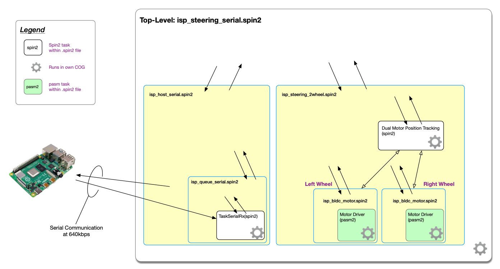

# P2-BLDC-Motor-Control - Via Serial from RPi, Arduino, or...

Serial control of our Single and Two-motor driver objects P2 Spin2/Pasm2 for our 6.5" Hub Motors with Universal Motor Driver Board

![Project Maintenance][maintenance-shield]

[![License][license-shield]](LICENSE)

## The Project

Instead of using the FlySky for remote control this document describes how to use a 2-wire serial interface to control your P2 hardware on your robot platform.

The code for this project implements an active serial receiver running on the P2 and a top-level application which listens for drive/status commands arriving via serial and then forwards the requests to the 2-wheel steering system and sends responses back over serial to the host.

## Current status

Latest Changes:

```
04 May 2022 v2.0.0
- Initial Public Release of Serial support
```

## Table of Contents

On this Page:

- [System Diagram](#system-diagram) - what are we setting up?
- [Download the latest files](#download-the-project-files) - get latest project files
- [Configure the RPi](#configuring-your-rpi) - one time configure your RPi 
- [Wiring the Serial Connection](#wiring-the-serial-connection) - Connect the RPi to the P2
- [Flashing your P2](#flashing-your-p2-edge) - flash to P2 with the drive code
- [Building your own drive code](#developing-your-own-drive-code) - write your own drive code!

Additional pages:

- [README](README.md) - The top level file for this repository
- [Steering and Motor control](DRIVE-OBJECTS.md) - The object public interfaces
- [Start your drive project using these objects](DEVELOP.md) - Walks thru configuration and setup of your own project using these objects
- [Drawings](DRAWINGS.md) - Files (.dwg) that you can use to order your own platform inexpensively
- [To-scale drawings](DOCs/bot-layout.pdf) of possible rectangular and round robotic drive platforms for Edge Mini Break and JonnyMac P2 Development boards
- [The author's development platform](AUTHORS-Platform.md) - Overview of the robot platform used when developing and testing the code for this project


---

## System Diagram

The following diagram shows the top-level serial object which hands off commands to the drive subsystem as they are received. It also shows the nested motor control and sense subsystem comprised of the two objects: steering and motor control.



In this diagram there are five **rectangular objects** depicting files (yellow background) of code. There are three methods within the motor files (white and green backgrounds) that are run in separate cogs and there is one method (white background) within the serial files that runs in a separate cog.  The **arrows** attempt to show which objects interact with each other and also show with which object the user application can interact.  The gear icon indicates which are running in their own Cog. You can see that the users' top-level control application runs in its own Cog as well.

## Download the project files

Head to the BLDC Motor repository [releases page](https://github.com/ironsheep/P2-BLDC-Motor-Control/releases) and download the `serial-control-archive-set.zip` file from the Assets section of the latest release. *(only present in v2.0.0 and later releases)*

Create a working directory and unpack this .zip there. In this .zip file you'll find an archive (.zip) of the P2 project files you need and a `pythonSrc.zip` of RPi side files you need.  We'll use all of these files in later steps.  Meanwhile, let's setup your RPi.

## Configuring your RPi

Set up for your RPi is nearly the same as we did for setting up the RPi for P2 IoT Gateway use. 

But, first, if you are configuring a bare new RPi then do: [Setting up your 1st Raspberry Pi](https://github.com/ironsheep/P2-RPi-IoT-gateway/blob/main/RPI-SETUP.md)

If you have a well setup RPi and just need to configure it for use in this contect then do the following...

First install extra packages the script needs:

### Packages for Ubuntu, Raspberry pi OS, and the like

```shell
sudo apt-get install git python3 python3-pip python3-tzlocal python3-sdnotify python3-colorama python3-unidecode python3-paho-mqtt python3-watchdog
```

### Finish the project install on the RPi

You need to select a location to install your platform-drive python script.

If you were installing in say your home directory/projects/ it might look something like this:

```shell
cd<return>  # insure you are in home directory

mkdir -p ~/projects/platform-drive    # make new directory (inclu. ~/projects/ if it doesn't exist)

cd ~/projects/platform-drive
```

Head back to the folder where you unpacked the `serial-control-archive-set.zip` file. Let's  unpack the `pythonSrc.zip` file found within.  Now copy the files from the newly created ./pythnSrc folder into this new directory on your RPi. One if the files should be a `requirements.txt` file and the other should be the demo script `P2-BLDC-Motor-Control-Demo.py`.  Finish up your system prep by ensuring the files needed for you drive script are installed with the following commands:

```shell
cd ~/projects/platform-drive            # make sure we are where the new files arrived
sudo pip3 install -r requirements.txt   # install supporting files
```


## Wiring the Serial Connection

The **P2-BLDC-Motor-Control-Demo.py** script is built to use the main serial I/O channel at the RPi GPIO Interface.  These are GPIO pins 14 & 15 (header pins 8 & 10).

**NOTE:** FYI a good reference is: [pinout diagram for RPi GPIO Pins](https://pinout.xyz/)

**RPi Wiring for Daemon use:**

| RPi Hdr Pin# | RPi GPIO Name| RPi Purpose | P2 Purpose | P2 Pin # |
| --- | --- | --- | --- | --- |
| 6 | GND | Signal ground| Signal ground | GND near Tx/Rx Pins|
| 8 | GPIO 14 | Uart Tx | Serial Rx (from RPi) | 57
| 10 | GPIO 15 | Uart Rx | Serial Tx (to RPi) | 56

Pick two pins on your P2 dev board to be used for RPi serial communications. The top-level file provided by this project defines these two pins as 56, 57. This was due to the two motor control boards occupying most of the remaining pins on the Mini Edge Breakout board. Feel free to choose different pins. Just remember to adjust the constants in your code to use your pin choices.

## Flashing your P2 Edge

The code for this project is setup for the P2 Mini Edge Breakout board with the two BLDC motor controllers installed at each of the dual-header locations. This leave one single header where you just connected the serial wires from the RPi.

Head back to the folder where you unpacked the `serial-control-archive-set.zip` file. Let's  unpack the *archive.zip file found within.

In the subfolder just created locate the `isp_steering_serial.spin2` file. Using Propeller tool select this file as our top-level file then compile and download to FLASH.  

**NOTE:** *this top-level file `isp_steering_serial.spin2` contains all pin-mappings. If you are not set up as the demo specified then make your pinout changes here before you flash the code.*

This should be all you need to test your new installation.  The demo file will drive the motors as if the platform is driving in a square (drive straight, turn right, drive strait, turn right, etc.)

You can test by running the following command on your RPi:

```shell
cd ~/projects/platform-drive            # make sure we are your project files are
./P2-BLDC-Motor-Control-Demo.py -d -v   # run with debug and verbose messaging enabled
```

If this is working for you, congratulations, you are all set up and ready to do your own drive code!


## Developing your own drive code

On your RPi copy the `P2-BLDC-Motor-Control-Demo.py` file to your own name:

```shell
cd ~/projects/platform-drive                        # make sure we are your project files are
cp /P2-BLDC-Motor-Control-Demo.py {newName}.py      # create new copy
```

Do all your development in this new file. Start by replacing the sqaure-pattern drive code with your own.  

Have fun!

### ...

---

> If you like my work and/or this has helped you in some way then feel free to help me out for a couple of :coffee:'s or :pizza: slices!
>
> [](https://www.buymeacoffee.com/ironsheep) &nbsp;&nbsp; -OR- &nbsp;&nbsp; [](https://www.patreon.com/IronSheep?fan_landing=true)[Patreon.com/IronSheep](https://www.patreon.com/IronSheep?fan_landing=true)

---

## Disclaimer and Legal

> *Parallax, Propeller Spin, and the Parallax and Propeller Hat logos* are trademarks of Parallax Inc., dba Parallax Semiconductor

---

## License

Copyright © 2022 Iron Sheep Productions, LLC. All rights reserved.

Licensed under the MIT License.

Follow these links for more information:

### [Copyright](copyright) | [License](LICENSE)

[maintenance-shield]: https://img.shields.io/badge/maintainer-stephen%40ironsheep%2ebiz-blue.svg?style=for-the-badge

[marketplace-version]: https://vsmarketplacebadge.apphb.com/version-short/ironsheepproductionsllc.spin2.svg

[marketplace-installs]: https://vsmarketplacebadge.apphb.com/installs-short/ironsheepproductionsllc.spin2.svg

[marketplace-rating]: https://vsmarketplacebadge.apphb.com/rating-short/ironsheepproductionsllc.spin2.svg

[license-shield]: https://camo.githubusercontent.com/bc04f96d911ea5f6e3b00e44fc0731ea74c8e1e9/68747470733a2f2f696d672e736869656c64732e696f2f6769746875622f6c6963656e73652f69616e74726963682f746578742d646976696465722d726f772e7376673f7374796c653d666f722d7468652d6261646765
